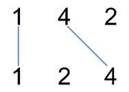

# Star crossed numbers
Given two sets of numbers on two parallel horizontal lines you can draw lines to connect identical numbers in each line. Given that lines between numbers cannot intersect each other what is the maximum number of lines that can be drawn for given sets.

You will be given two sets of numbers and your output should be the maximum number of lines that can be drawn.

| Input	| Visualisation	| Output	|
|-------|---------------|---------------|
| [1,4,2], [1,2,4] | 1->1, 4->4 | 2 |
| [2,5,1,2,5], [10,5,2,1,5,2] | 5->5, 1->1, 2->2 | 3 |
| [1,3,7,1,7,5], [1,9,2,5,1] | 1->1, 1->1 | 2 |
